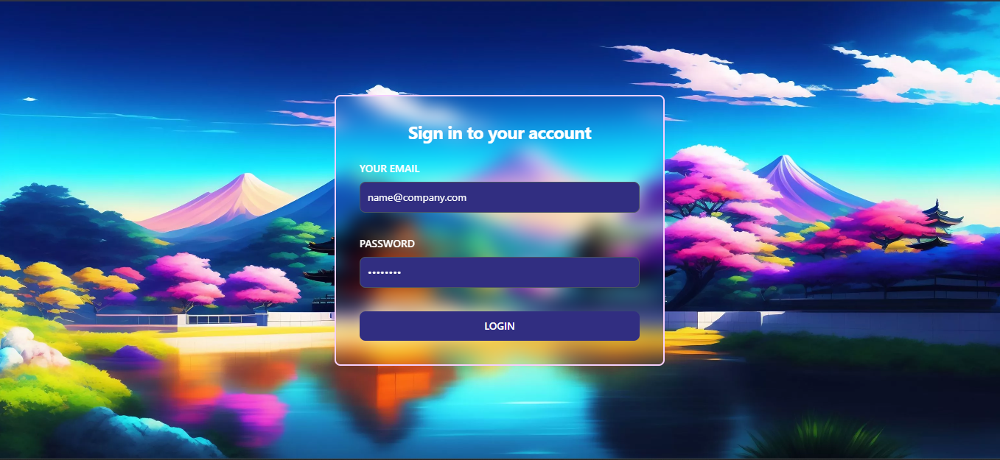
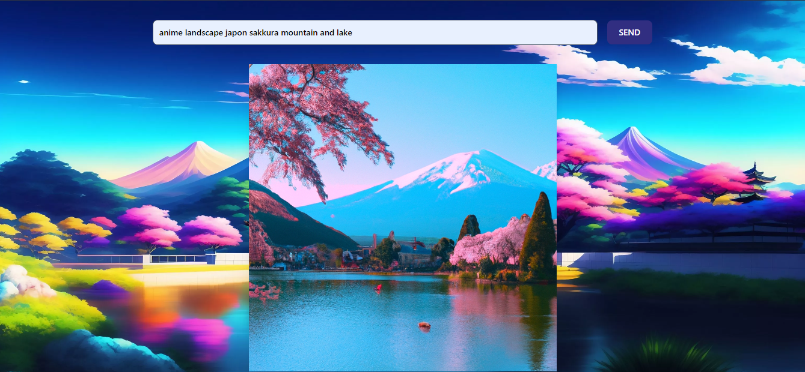

<br/>
<p align="center">
  <h3 align="center">Image Generator API</h3>

  <p align="center">
    Image Generator API using Dall-E, Spring boot + Spring Security & Json Web Token
    <br/>
    <br/>
    <a href="https://github.com/manesjonathan/image-generator/issues">Report Bug</a>
    .
    <a href="https://github.com/manesjonathan/image-generator/issues">Request Feature</a>
  </p>

    

## About The Project




This project is created using Java Spring framework and OpenAI Dall-E API to generate image.

This project use Spring Security to authenticate users using Json Web Token. The users are pre-registred in a Postgresql database.

It also uses AWS S3 to store the generated images.

At creation, the registered user has 1 credit. Each time he generates an image, he loses 1 credit. 
but there is an option to refill the credits by paying with Stripe.

## Getting Started

To get a local copy up and running follow these simple example steps.

### Installation

1. Get an API Key at [https://openai.com/]

2. Configure AWS S3 and create a bucket. You will need the access key and secret key.

3. Create a Stripe account and get the secret key.

4. Create a Postgresql database.

5. Clone the repo

```sh
git clone https://github.com/manesjonathan/image-generator.git
```

6. Enter your database credentials and OpenAI API key in `application.properties`

```properties
spring.jpa.database=POSTGRESQL
spring.sql.init.platform=postgres
spring.datasource.url=jdbc:postgresql://[YOUR_URL]/[DB_NAME]
spring.datasource.username=[DB_USERNAME]
spring.datasource.password=[DB_PASSWORD]
spring.jpa.hibernate.ddl-auto=update

app.jwt.secret=[PASSWORD_FOR_JWT]
app.openai.api=[OPENAI_API_KEY]

aws.access.key=[AWS_ACCESS_KEY]
aws.secret.key=[AWS_SECRET_KEY]
stripe.secret.key=[STRIPE_SECRET_KEY]
custom.admin.email=[ADMIN_EMAIL]

```

6. Update the Stripe webhook in your Stripe account. If you run locally, you can use [ngrok](https://ngrok.com/) to create a public URL for your localhost.

7. Run the project


## Contributing

The following features are planned for the next release:
* Add a feature to rate the generated images

Contributions are what make the open source community such an amazing place to be learn, inspire, and create. Any contributions you make are **greatly appreciated**.
* If you have suggestions for adding or removing projects, feel free to [open an issue](https://github.com/manesjonathan/image-generator/issues/new) to discuss it.
* Please make sure you check your spelling and grammar.
* Create individual PR for each suggestion.

### Creating A Pull Request

1. Fork the Project
2. Create your Feature Branch (`git checkout -b feature/AmazingFeature`)
3. Commit your Changes (`git commit -m 'Add some AmazingFeature'`)
4. Push to the Branch (`git push origin feature/AmazingFeature`)
5. Open a Pull Request

## License

Distributed under the MIT License. See [LICENSE](https://github.com/manesjonathan/image-generator/blob/main/LICENSE) for more information.

## Authors

* [Jonathan Manes](https://github.com/manesjonathan/) - *Full Stack Developer*
